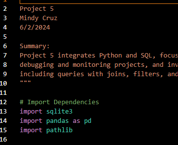

# datafun-05-sql-project
Project Detials:
[Module 5 Project ](https://github.com/denisecase/datafun-05-spec)


Created new Repo and Cloned:
```
git clone URL
In the step I made sure to add README.md when creating REPO.

```
Added .gitignore 

Activated virtual enviroment and Installed dependencies
```
py-m venv .venv
.\.venv\scripts\activate
py -m pip install pandas pyarrow
py -m pip freeze > requirements.txt
```


When pushing new info to GitHub using the following template:
Git Add and Commit
``` 
git add .
git commit -m "add .gitignore, cmds to readme"
git push origin main
```

Added Data Folder and sql Folder
*created authors.csv and books.csv

Created each of the sql folders that corresponded with teach sql that was required in the project.

Conclusion:

The core components of starting a project are the same. Depending on the tools you are using, you will have to adjust and seek guidance. I rely on google and AI to help me understand and get through these projects.


